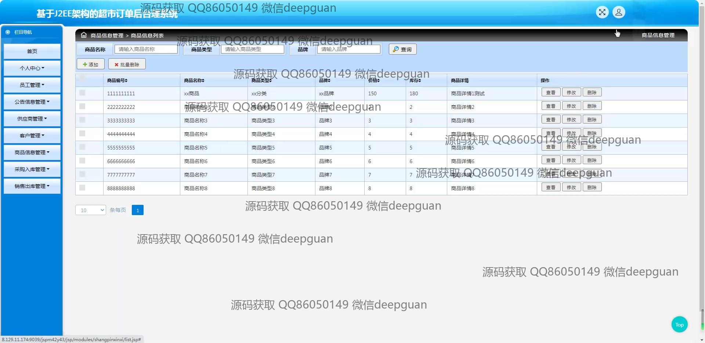
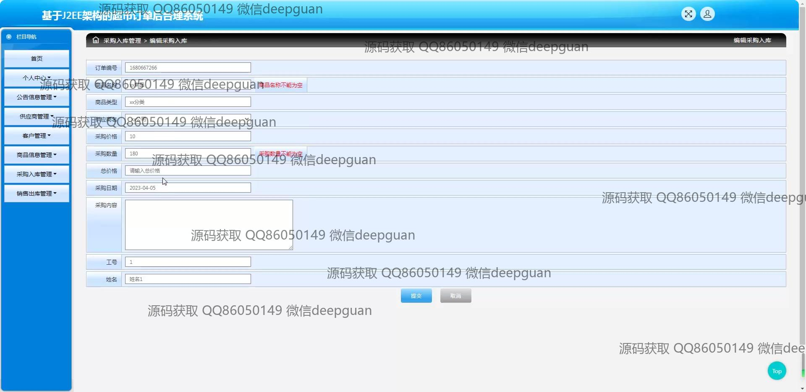

<h1 align="center">基于JEE架构的超市订单后台理系统</h1>

## 简介
超市订单后台管理系统：功能包括订单管理、客户管理、供应商管理、商品信息管理、公告信息管理，支持采购入库和销售出库管理，提供用户友好的界面和操作体验。    --计算机毕业设计源码；毕设源码；java毕业设计源码

## 联系方式

<h3 align="center">获取完整代码与数据库文件 + 微信：deepguan QQ: 86050149 QQ群: 783742310</h3>

<h3 align="center">可帮忙远程部署 包运行成功！提供远程部署、修改代码、设计文档指导、代码讲解等服务！</h3>

## 功能介绍（完整见运行截图）
管理员：管理员可以通过导航菜单轻松访问各个管理模块，包括个人中心、员工管理、公告信息管理、供应商管理、客户管理、商品信息管理、采购入库管理和销售出库管理。每个模块提供编辑、查看、删除和查询等功能，支持添加供应商、编辑客户信息、管理商品库存及更新公告信息。销售出库和采购入库的模块具备详细的订单信息显示与搜索功能，用户通过提交按钮保存对数据的更改。此外，管理员还可以查看采购和销售的统计图表，辅助决策。

用户：用户主要使用“个人中心”来查看和修改个人信息及密码。个人中心模块让用户能够及时更新自己的详细资料，保障账户的有效管理。通过客户管理模块，用户可以更新客户信息，包括姓名、联系方式和地址等以确保信息准确。商品信息管理页面允许用户搜索商品，查看商品详情，进行增删改操作。公告信息模块则给用户一个阅读和了解最新公告的平台，使他们随时掌握最新的系统通知和更新内容。用户可以方便地浏览系统界面，通过操作菜单在不同管理模块间切换。

## 运行截图

本代码来源于网络,仅供学习参考使用!

